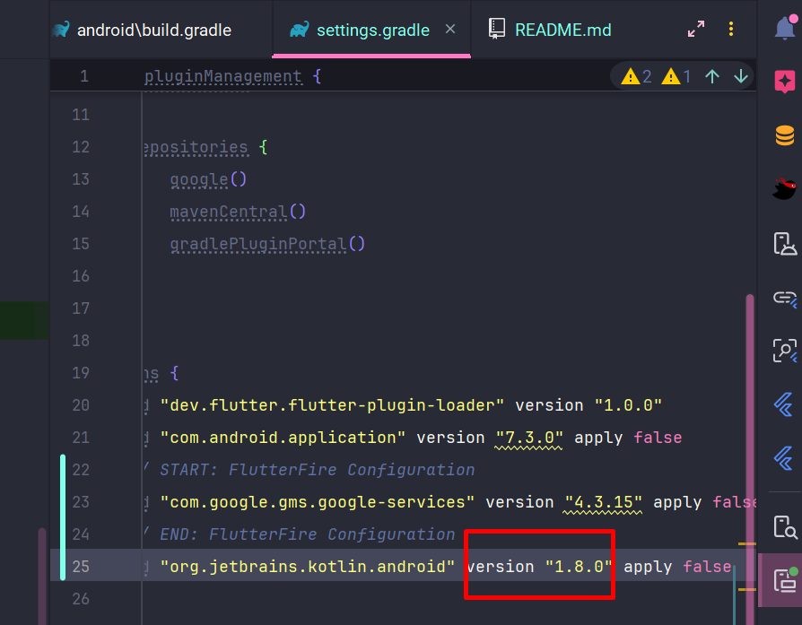

# social_media

A new Flutter project.

## Getting Started

This project is a starting point for a Flutter application.

A few resources to get you started if this is your first Flutter project:

- [Lab: Write your first Flutter app](https://docs.flutter.dev/get-started/codelab)
- [Cookbook: Useful Flutter samples](https://docs.flutter.dev/cookbook)

For help getting started with Flutter development, view the
[online documentation](https://docs.flutter.dev/), which offers tutorials,
samples, guidance on mobile development, and a full API reference.

======================= FIREBASE GUIDE ============================
1. install firebase tool
`npm i -g firebase-tools`

2. login your firebase account:
`firebase login`
''require node >= 18''

3. activate flutter firebase cli
`dart pub global activate flutterfire_cli`

4. Add path variable for:
`C:\Users\marco.pham\AppData\Local\Pub\Cache\bin`

5. config firebase to flutter project
`flutterfire configure`

6. add firebase_core to pubspec
`flutter pub add firebase_core`

7. Fix error:
`What went wrong: Execution failed for task ':app:checkDebugDuplicateClasses'. > A failure occurred while executing com.android.build.gradle.internal.tasks.CheckDuplicatesRunnable`

upgrade org.jetbrains.kotlin.android to 1.8.0 in setting.gradle

8. add firebase_auth to pubspec
`flutter pub add firebase_auth`

======================= FIRE_STORE GUIDE ============================
1. add dependency
`flutter pub add cloud_firestore`